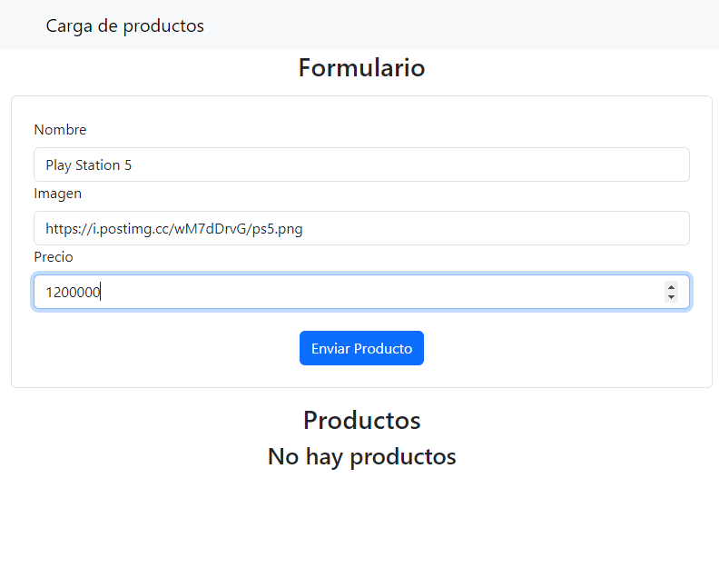
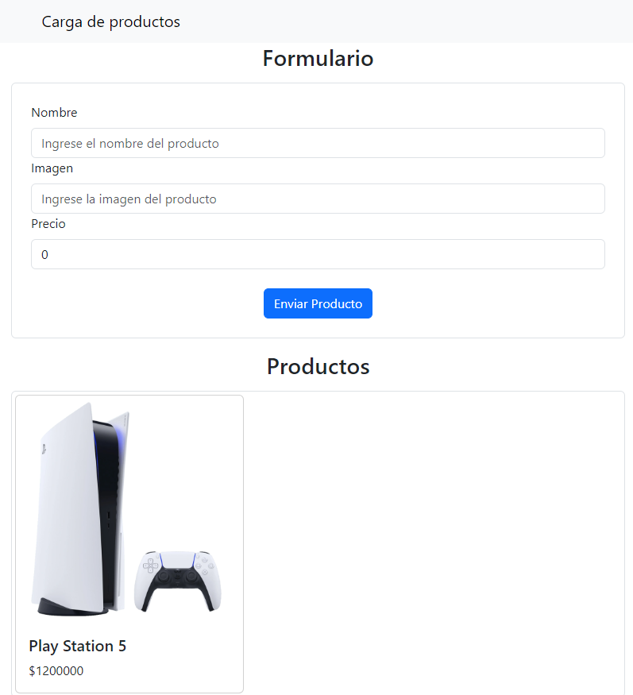

# Proyecto de Carga de Productos

Este es un proyecto sencillo realizado con TypeScript y React que permite a los usuarios cargar productos a través de un formulario y visualizarlos en una lista.

## Propietario

- Escudero Fabio
- Comisión: 3K10
- Materia: Desarrollo de SoftWare
- Año: 2024

## Características

- Formulario para agregar productos con nombre, imagen y precio.
- Lista de productos que se actualiza dinámicamente.
- Interfaz de usuario construida con React Bootstrap.

## Tecnologías Utilizadas

- **React**: Biblioteca de JavaScript para construir interfaces de usuario.
- **TypeScript**: Lenguaje de programación que añade tipos estáticos a JavaScript.
- **React Bootstrap**: Biblioteca de componentes de interfaz de usuario basada en Bootstrap.


## Instalación

1. Clona el repositorio:

```bash
git clone https://github.com/XxFabio24xX/React-TypeScript
```
2. Navega al directorio del proyecto:
```bash
cd React-TypeScript
```

3. Instala las dependencias:
```bash
npm install
```

## Uso

1. Inicia el servidor de desarrollo:

```bash
npm run dev
```

## Componentes

### App.tsx
El componente principal que renderiza el componente AppProduct.

### AppProduct.tsx
El componente que maneja el estado de los productos y renderiza el formulario y la lista de productos.

### Header.tsx
El componente que renderiza el encabezado de la aplicación.

### FormProducts.tsx
El componente que renderiza el formulario para agregar productos.

### ListProducts.tsx
El componente que renderiza la lista de productos.

## Hooks

### useForm.ts
Un hook personalizado para manejar el estado del formulario.

## Capturas de Pantallas

### Carga Producto


### Producto Cargado
